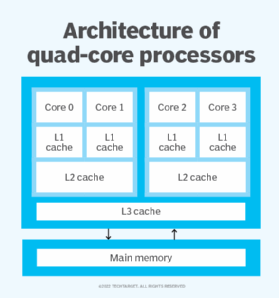

## What is a Core?

In the last lessons we looked at [Little Man Computer](https://peterhigginson.co.uk/lmc/) which is a model of a basic computer. Little Man Computer is a model of a very old simple CPU. Modern CPUs are vastly improved and have much more functionality. Little Man Computer was capable of doing one thing at one time, as it only had one set of registers, one ALU and so on. A core is a separate set of all of these things in a single processor.

||
|:--:|
|[Source](https://www.techtarget.com/whatis/definition/quad-core-processor)|

Each element labelled "Core X" in the diagram above represents a processing unit. As you can also see from this diagram, all of the cores in this chip share the same main memory. The architecture above is called a quad core architecture as it has four cores in it. Modern computers may have up to 18 cores, but these are normally used for specific, processing-heavy use cases.

Because the cores are separate they can perform multiple tasks at once. In the chip architecture shown, a quad-core architecture, the processor is capable of running four tasks simultaneously. 

Alternatively, large tasks can be broken down into separate parts and the processor can approach each part of the task separately and then recombine them, a process called parallel computing. 

Also to note is the cache available to each core, leading to the question.

## What is cache?

CPU cache is another type of memory. In Little Man Computer we loaded everything from the RAM, but that is not strictly speaking true. Modern CPUs are incredibly fast, approximately 10-100 times faster than RAM. This means that if every instruction had to be loaded from the RAM, the CPU would spend most of its time waiting for instructions creating a bottleneck. To get around this problem we used cache, a type of memory that is typically located in the processor itself to keep instructions that are being worked on right now. 

[This video](https://youtu.be/yi0FhRqDJfo) gives a very clear description of both cache and the different levels.

The reason for using cache is typical of the trade offs that are needed when designing computers. Given the choice the majority of people would choose the fastest computer, this would mean allowing more cache on the CPU to speed up processing speed. However, cache is considerably more expensive than RAM, hence more RAM is used. Part of the job of designing chips is managing these trade offs for different purposes.

## Instruction sets
In Little Man Computer, there were a [list of instructions](https://peterhigginson.co.uk/lmc/help.html) that the computer could use. They included operations like input/output, load and save data, branching and so on. This list of instructions is called the "Instruction Set". These instructions define what calculations it is that the computer carry out. As you've seen from Little Man Computer, this is a very small and simple instruction set designed to teach you about some basic operations that a computer can do. [Modern instruction sets](https://www.felixcloutier.com/x86/) include many hundreds of operations. The ones that you used on Little Man Computer will still be there, but there are many others. Some examples are:

- mathematical operations such as addition, subtraction, multiplication, division and modulus
- ways of storing different data types such as Booleans, integers and floating point numbers
- logical operations such as NOT, AND, OR, NAND, NOR, XOR, and so on
- bitwise operations like shift left or right
- instructions to load, copy and remove files from memory
- increment and decrementing numbers (adding or subtracting one)

There are many more operations that they can do, but that is beyond the scope of this course and deep into university level Computer Science.

  > ### Questions
  > 1. Why do you think we have different levels of cache?
  > 2. What is the relationship between the number of cores and the speed of the computer?
  > 3. 
